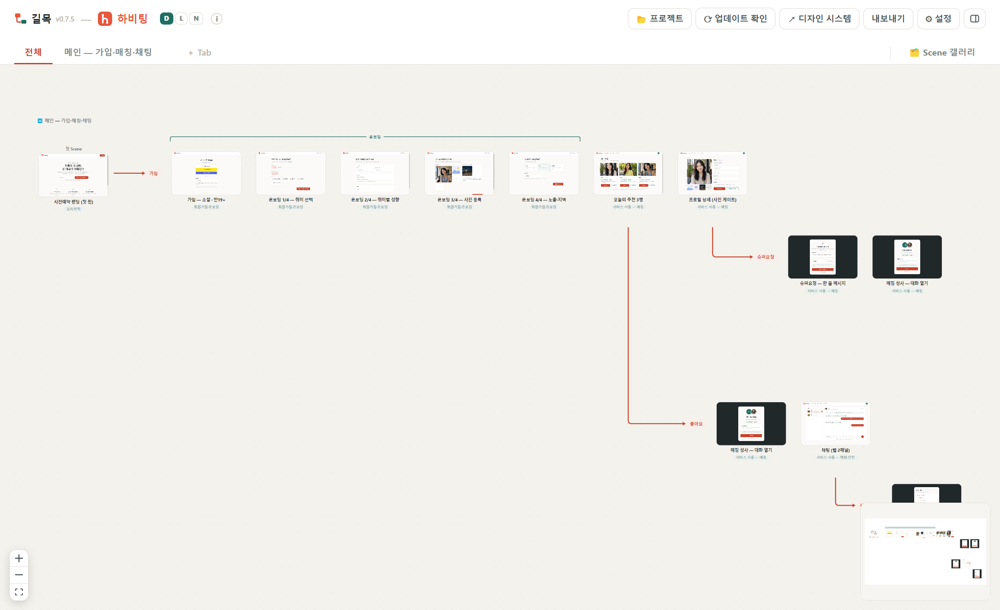
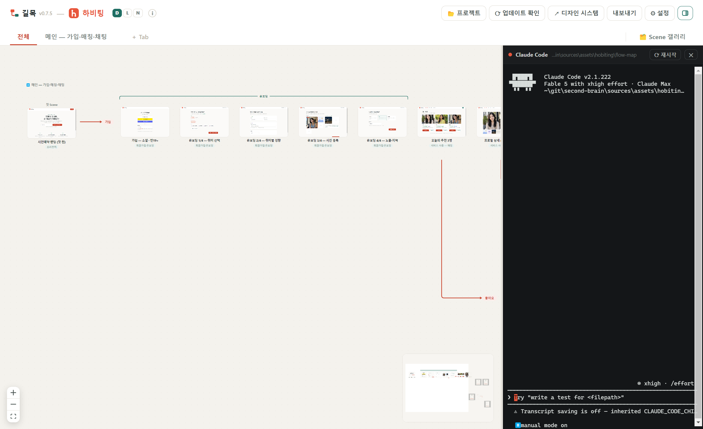

<div align="center">


# 길목

**서비스 흐름을 분기 라인 위 Scene 프리뷰로 조망·편집하는 데스크톱 앱**

흐름이 갈라지는 "길목"을 내려다보는 도구 · 저장소 `gilmok` · 설치 파일 `gilmok-setup-*.exe`

  



</div>

---

## 무엇을 하는 앱인가

기획 중인 서비스의 화면(Scene) HTML들을 **플로우 다이어그램 위에 실물 썸네일로** 늘어놓고, 분기(Branch)·구간(Bracket)·노트를 붙여 전체 흐름을 한눈에 본다. 모든 편집은 `flow.json` 하나에 자동 저장되므로 **AI에게는 이 파일 하나만 읽히면** 전체 플로우를 이해시킬 수 있다.

## 왜 만들었나

피그마·프레이머 같은 범용 디자인 도구는 화면을 그리는 데는 강력하지만, 작업물이 구조화된 데이터로 남지 않는다. 흐름 정보가 도구 내부 포맷에 갇혀 있어 AI가 전체 플로우를 파악하기 어렵고, 수정을 맡기는 것도 매끄럽지 않다.

길목은 반대로 간다. 범위를 **서비스 플로우 하나로 좁히고**, 화면 순서·분기·구간·노트·배치까지 모든 상태를 **AI가 그대로 읽고 고칠 수 있는 `flow.json` 하나에 담는다**. 사람은 캔버스에서 보고 만지고, AI는 같은 데이터를 텍스트로 다룬다 — 이것이 길목의 출발점이다.

## 주요 기능

- **캔버스 뷰어** — React Flow 기반. 팬/줌(Ctrl+휠, 스페이스+드래그), 실사 썸네일 미니맵, 탭별 뷰포트 기억, 앱 라이트/다크 테마
- **드래그 편집** — 카드 드래그로 순서 이동(다른 Branch로도), Branch 라벨 드래그로 재앵커·**자유 배치**(블록 통째 이동, 겹치면 빨간 박스로 안내 후 원위치), Shift+드래그 → 우클릭으로 Bracket 묶기, 모든 편집 Ctrl+Z
- **⌨ 내장 Claude Code 터미널** — 데이터 폴더에서 `claude` CLI를 바로 실행(로컬 로그인·구독 그대로, API 키 불필요). AI가 flow.json을 고치면 캔버스에 즉시 반영
- **📂 프로젝트 메뉴** — 현재 폴더 확인·탐색기 열기·최근 프로젝트 전환·다른 폴더 선택을 버튼 하나로
- **⧉ 새 창 (Ctrl/Cmd+Shift+N)** — 창을 하나 더 띄워 다른 프로젝트를 나란히 연다. 창마다 프로젝트·터미널·감시가 독립
- **Scene 갤러리** — 그룹(카테고리)별 썸네일 카탈로그
- **캡처 씬** — 타 서비스 화면 캡처(이미지)를 `captures/`에 두고 `kind: "capture"`로 등록하면 HTML 씬과 똑같이 플로우에 배치. 자체 화면이 나오면 `file`만 바꿔 교체
- **claude.ai/design 연동(선택)** — Scene별 편집 딥링크, 디자인 시스템 바로가기, flow-sync 스킬 설치
- **⟳ 앱 내 업데이트 확인** — 새 릴리스 확인 후 설치 파일 수동 업데이트(서명/공증 불필요 구조)

<div align="center">

<br/><sub>내장 Claude Code 터미널 — AI가 flow.json을 편집하면 캔버스에 즉시 반영</sub>
<br/><br/>

<br/><sub>📂 프로젝트 메뉴 — 현재 폴더 열기와 프로젝트 전환을 한 곳에서</sub>
</div>

## 설치

1. [Releases](https://github.com/youjeonghan/gilmok/releases)에서 설치 파일 다운로드
   - Windows: `gilmok-setup-<버전>.exe` (SmartScreen 경고 시 '추가 정보 → 실행')
   - mac: `gilmok-<버전>-arm64.dmg` (Gatekeeper 차단 시 시스템 설정 → 개인정보 보호 및 보안에서 허용)
   - 구버전 파일명(`flow-map-setup-*`)은 v0.7.7 이전 릴리스 — 업데이트 확인은 그대로 동작
2. 실행 → **📂 프로젝트**로 `flow.json`이 있는 데이터 폴더 선택 (마지막 프로젝트 기억)
3. 편집은 자동 저장. 업데이트는 **⟳ 업데이트 확인** 버튼

> 자세한 사용법은 **[Wiki](https://github.com/youjeonghan/gilmok/wiki)** 참고 — [시작하기](https://github.com/youjeonghan/gilmok/wiki/시작하기) · [사용법](https://github.com/youjeonghan/gilmok/wiki/사용법) · [flow.json 스펙](https://github.com/youjeonghan/gilmok/wiki/flow.json-스펙) · [Claude Code 연동](https://github.com/youjeonghan/gilmok/wiki/Claude-Code-연동) · [FAQ](https://github.com/youjeonghan/gilmok/wiki/FAQ) (원본: [docs/](docs/README.md))

## 개발 실행

```
npm install
npm start                  # vite build 후 Electron 실행
npm run dev                # 뷰어만 브라우저 개발 서버 (정적 모드, ?data= 로 데이터 지정)
npm run dist               # 로컬 인스톨러 빌드
```

뷰어 소스는 `src/`(React + TS), 빌드 출력은 `web/` — Electron(`main.js`)과 Go 서버(`main.go` embed)가 그대로 서빙한다.
레이아웃 좌표 계산은 `src/layout.ts`, 캔버스 인터랙션은 `src/components/FlowCanvas.tsx`.

### Go 서버 (헤드리스/폴백)

`main.go` — 뷰어를 내장한 단일 바이너리 서버. 릴리스의 `gilmok-server-*`.

```
gilmok-server <데이터폴더>   # 브라우저로 열림, flow.json 자동 저장
```

## 데이터 폴더 규약

```
<project>/gilmok/        # 폴더명은 자유 — 기존 flow-map/ 폴더도 그대로 동작
  flow.json     # 플로우 정본 — 아래 스키마
  scenes/…      # Scene HTML (self-contained). claude.ai/design 미러라면 scenes/<원격경로>
  captures/…    # 가져온 화면(타 서비스 캡처 등) 이미지. NN.jpg 번호는 추가 순서 (플로우 순서 아님)
```

## flow.json 스키마

```jsonc
{
  "version": 3,
  "service": { "name": "하비팅", "icon": "app-icon.svg",         // 이모지·이미지 경로/URL·업로드(data URL)
               "designUrl": "https://claude.ai/design/p/<id>" },  // (선택) 클로드 디자인 프로젝트
  "tabs":   [ { "id", "title", "start" } ],          // Tab = 독립 플로우, start = 루트 Scene id (null = ＋카드)
  "scenes": { "<id>": {
      "title",                                        // 표시 이름 (id는 제목 슬러그로 자동 발급, UI 비노출)
      "file",                                         // default 테마 Scene 경로 · null = 미제작 · HTML 또는 이미지(png/jpg/webp/gif)
      "kind",                                         // design(내가 만든 씬) · capture(가져온 화면 — 📷 배지, 딥링크 없음)
      "themes": { "dark": "…" },                      // 테마별 대체 Scene
      "group",                                        // (선택) 카테고리 — 갤러리 그룹·디자인 시스템 그룹
      "updated", "note" } },
  "flows":  [ { "id", "tab", "from", "label", "note",
                "seq": ["sceneId", ...],
                "brackets": [ { "label", "start", "end", "note" } ] } ],
  "layout": { "<tabId>": { "offsets": { "<flowId>": { "dx", "dy" } } } }  // 자유 배치 오프셋
}
```

- **id vs 제목**: 제목은 표시용, id는 내부 키(파일 매핑·seq 참조·AI 참조). 제목 슬러그로 자동 발급, 중복 시 `_2`.
- 플로우·분기·범주·노트·배치가 flow.json 하나에 있으므로 AI에게는 이 파일만 읽히면 된다.

## claude.ai/design 연동 (선택)

`service.designUrl`을 설정(⚙)하면:

- 헤더 '↗ 디자인 시스템' + Scene 카드 '↗ 디자인' (딥링크 `?file=<원격경로>`, 로컬 `scenes/` 접두사 제거 규약)
- 헤더 '⤓ 스킬 설치' — 데이터 폴더가 속한 git 레포의 `.claude/skills/flow-sync/`에 [flow-sync 스킬](skills/flow-sync/SKILL.md)을 설치. 이후 Claude Code에서 `/flow-sync`로 원격 Scene 동기화.

## 버전 정책 · 릴리스

**0.x대에서 1.0을 준비 중** — 패치는 `0.7.x`, 다음 기능 단위는 `0.8.0`, 정식 출시가 `1.0.0`. (구 `7.x` 태그는 히스토리)

태그를 푸시하면 GitHub Actions가 Windows 인스톨러(NSIS)·mac dmg/zip·Go 서버 바이너리를 빌드해 Release에 첨부한다:

```
git tag v0.7.6 && git push origin v0.7.6
```

버전 이력: [CHANGELOG.md](CHANGELOG.md)
