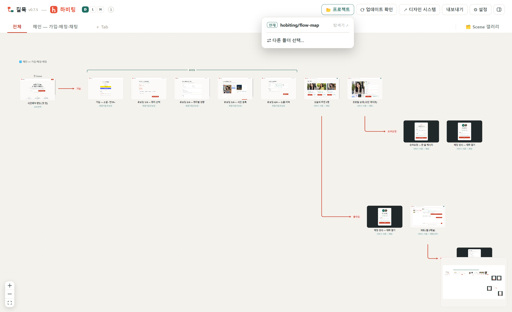

# 시작하기

## 설치

[Releases](https://github.com/youjeonghan/flow-map/releases)에서 최신 설치 파일을 받는다.

| OS | 파일 | 참고 |
|---|---|---|
| Windows | `flow-map-setup-<버전>.exe` | SmartScreen 경고 시 **추가 정보 → 실행** |
| mac | `flow-map-<버전>-arm64.dmg` | Gatekeeper 차단 시 **시스템 설정 → 개인정보 보호 및 보안**에서 허용 |

설치 후 시작 메뉴/앱 목록에 **길목**으로 등록된다.

## 첫 프로젝트 열기

1. 앱 실행 → 헤더 우측 **📂 프로젝트** 클릭
2. **⇄ 다른 폴더 선택…** 으로 `flow.json`이 있는 데이터 폴더 선택
3. 이후에는 마지막 프로젝트를 기억해 자동으로 연다. 📂 프로젝트 메뉴에서 **현재 폴더 확인·탐색기 열기·최근 프로젝트 전환**이 모두 가능하다.



## 데이터 폴더 규약

앱과 데이터는 분리되어 있다. 프로젝트마다 폴더 하나:

```
<project>/flow-map/
  flow.json     # 플로우 정본 — 탭·Scene·분기·범주·노트·배치 전부
  scenes/…      # Scene HTML (self-contained 권장)
  app-icon.svg  # (선택) 프로젝트 아이콘 — flow.json service.icon에서 참조
```

- 모든 편집은 **flow.json에 자동 저장**된다. 별도 저장 버튼 없음.
- 외부(에디터·AI·git)에서 flow.json을 고치면 **약 2초 안에 캔버스에 반영**되고, Ctrl+Z로 되돌릴 수도 있다.
- 처음 시작한다면 빈 폴더에 `flow.json` 최소 골격만 두고 열어도 된다 — [flow.json 스펙](flow-json.md) 참고.

## 다음 단계

- 조작법 전체: [사용법](usage.md)
- AI로 플로우 편집: [Claude Code 연동](claude-code.md)
